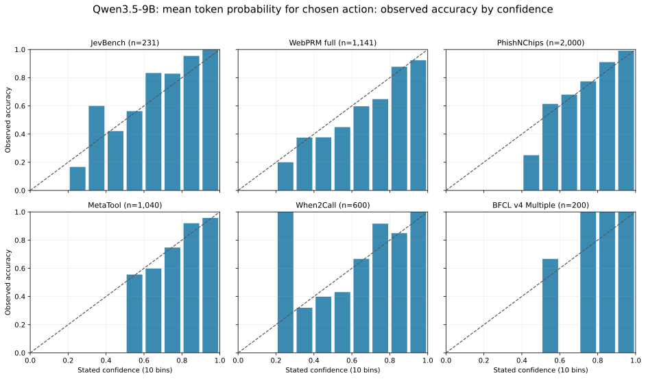
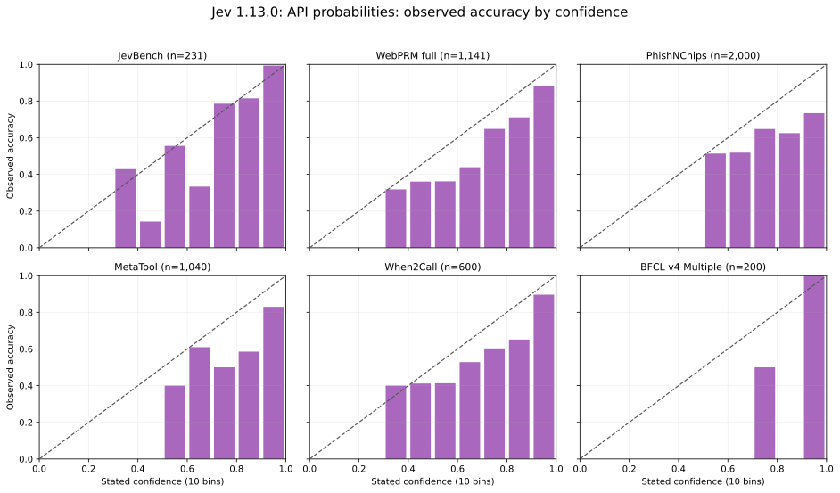

# Calibration of decision probabilities

We compare the released, **unmodified Qwen3.5-9B** with hosted Jev 1.13.0 on the same 5,212 labeled decisions. Neither model is fitted or temperature-scaled for this analysis. The evaluation reads the saved option probabilities and answer labels; it does not rerun inference.

Qwen's **token probability** is the softmax probability of an answer letter among the supplied answer letters, immediately after `Answer: `. When the prompt rotates option order, we map probabilities back to the original choices and average across rotations. This direct probability can select a different answer from our existing scoring rule, which sums log probabilities across rotations and then applies softmax. Jev uses the probabilities returned by its hosted `Choice` API. Both are distributions over the offered actions, not probabilities over the entire language-model vocabulary.

If `p_r(a)` is action `a`'s option-normalized token probability in rotation `r`, the direct rule is `mean_r p_r(a)`. The current rule is `product_r p_r(a) / sum_b product_r p_r(b)`. Multiplying probabilities across rotations generally makes the distribution sharper. For example, two binary rotations assigning an action probabilities 0.9 and 0.4 give it 0.65 by direct averaging but 0.857 by the current rule. On WebPRM, only one option order was run, so the two rules coincide. Our **hybrid** reports `mean_r p_r(a)` as confidence for the action chosen by the current rule. It reuses the same rotations and preserves the main benchmark decisions.

## Results

Lower is better for both calibration measures. **ECE** groups selected-action confidences into 10 fixed bins and averages the gap between confidence and accuracy. **Brier** is the mean sum of squared differences between each action probability and the one-hot correct answer. Accuracy is included because confidence calibration alone does not measure decision quality.

| Benchmark | Decisions | Qwen hybrid ECE | Qwen current ECE | Jev ECE | Qwen hybrid Brier | Qwen current Brier | Jev Brier |
| --- | ---: | ---: | ---: | ---: | ---: | ---: | ---: |
| JevBench | 231 | 0.084 | 0.118 | **0.045** | 0.272 | 0.295 | **0.178** |
| WebPRM full | 1,141 | **0.063** | **0.063** | 0.118 | 0.550 | 0.550 | **0.478** |
| PhishNChips | 2,000 | **0.039** | 0.093 | 0.153 | **0.365** | 0.384 | 0.505 |
| MetaTool | 1,040 | **0.036** | 0.093 | 0.165 | **0.237** | 0.258 | 0.376 |
| When2Call | 600 | **0.083** | 0.291 | 0.105 | 0.500 | 0.646 | **0.385** |
| BFCL v4 Multiple | 200 | 0.023 | **0.003** | 0.006 | 0.010 | **0.005** | 0.009 |
| **Mean across six benchmarks** | **5,212 total** | **0.055** | 0.110 | 0.099 | 0.323 | 0.357 | **0.322** |

The mean gives each benchmark equal weight. Qwen's hybrid has lower mean ECE than Jev (0.055 vs 0.099); mean multiclass Brier is nearly equal (0.323 vs 0.322). In a paired bootstrap that resamples decisions within each benchmark (1,000 draws, seed 42), the 95% interval for **Qwen hybrid minus Jev** is **−0.054 to −0.028** for mean ECE and **−0.010 to +0.012** for mean Brier. These intervals describe sampling variation on these six datasets; they do not establish transfer to new tasks.

We chose to report the hybrid after inspecting these six results. It has no fitted weights or temperature, but its small ECE advantage over direct averaging (0.055 vs 0.057) should be checked on held-out tasks.

Jev has lower ECE on JevBench and BFCL, and lower Brier on JevBench, WebPRM, and When2Call. Qwen's current rotation aggregation is substantially more confident than its mean token probabilities on When2Call: mean confidence 0.906 versus 0.611. ECE is 0.291 if the aggregated score is used as confidence and 0.083 with hybrid confidence. If direct probabilities also choose the action, accuracy falls to 360/600 from the current rule's 371/600. The hybrid retains the 371/600 decisions in the main [benchmark table](../README.md#results).



[Download Qwen PNG](assets/calibration_qwen.png).



[Download Jev PNG](assets/calibration_jev.png).

Each figure uses the same six benchmarks and 10 confidence ranges. Each bar is the observed accuracy of decisions in one range. Missing bars mean that model had no decisions in that range. The dashed straight line is perfect calibration: accuracy equals stated confidence. Bin populations vary, so these diagrams should be read with the numbers above. The Qwen figure uses the same hybrid rule on every benchmark; it does not select a different rule per benchmark.

## Reproduce

```bash
python scripts/eval_calibration.py
uv run --no-project --with matplotlib python scripts/plot_calibration.py
```

The standard-library evaluator reads the committed Qwen rotation log probabilities and Jev API responses, checks that item IDs and labels match, and writes [summary metrics](../results/calibration/summary.json) and [per-decision probabilities](../results/calibration/records.jsonl). It checks matching input hashes where those are saved. The script also computes the paired bootstrap interval and 90%-confidence coverage and accuracy. The plotting command regenerates both figures in SVG and PNG.

The 120-item WebPRM sample is omitted because it overlaps the full WebPRM set. DeepSWE records a selected trajectory's verifier outcome, but not one uniquely correct candidate. Doom and WebShop record closed-loop outcomes, not a gold action at each step. Those tasks cannot supply the per-decision labels needed for this categorical calibration test.

Jev probabilities are often rounded to two decimal places. We use them as returned, without renormalization. ECE depends on the chosen bins and can be low for a weak but conservatively confident classifier; Brier and accuracy give additional context. Qwen's option-normalized probabilities exclude non-option tokens, so they should not be read as probabilities of unconstrained text generation.

## What the comparison controls

Each pair uses the same benchmark item, offered actions, and gold label. Both methods use the same metric code, and neither receives calibration fitting on these labels. This makes the comparison valid for the **saved decision distributions on these tasks**.

It is not a controlled comparison of architecture or probability estimation alone. Jev receives its typed API prompt and returns a `Choice` distribution; Qwen receives its answer-letter prompt and, except on WebPRM, scores several rotations. The hybrid uses the already-computed mean token probabilities but keeps the original decisions. If direct probabilities also select the action, 21 predicted actions change across all six suites, including 18 on When2Call. Jev's returned values are rounded; nine recorded selections are tied for the highest displayed probability, and we retain the API's selected action. The two systems therefore differ in prompt, inference work, and probability resolution. Differences in accuracy and benchmark composition also affect ECE; the per-suite Brier scores and accuracies should be considered alongside it.
