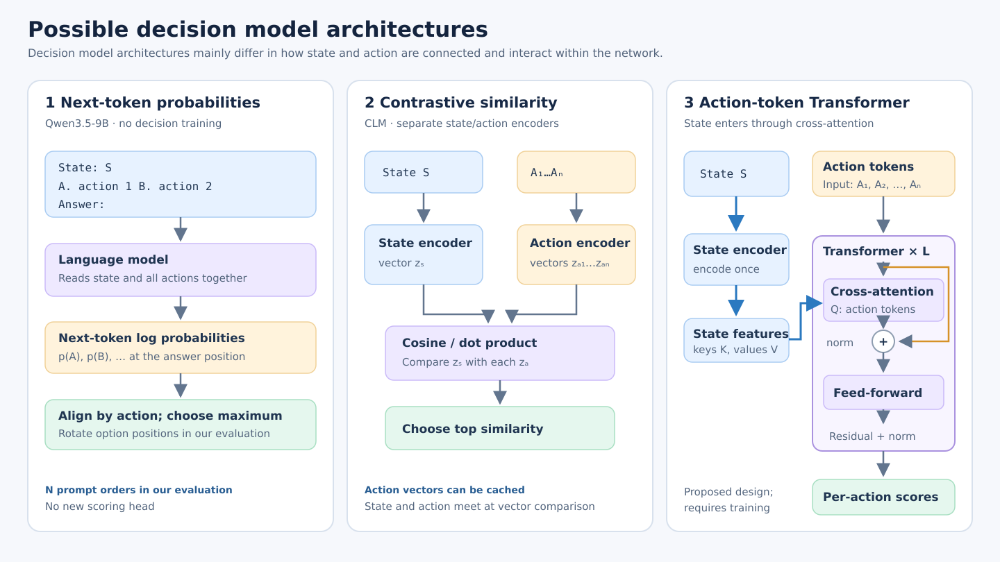

# Four ways to score candidate decisions

Let **S** be the current state, **A₁…Aₙ** the candidate actions, **N** the number of candidates, and **T** the number of state tokens or visual features. The architectures differ in *where the state and action meet*. Images are not excluded by a state/action formulation: any of these patterns can be made multimodal with a suitable encoder, inputs, and training data. The models in this repository have different **implemented** modality support from that broader possibility.

| Pattern | Inference path | Typical training objective | Reuse and cost as N grows | Modalities and current status |
|---|---|---|---|---|
| **1. Letter log probabilities (our Qwen3-8B baseline)** | Put S and **all** A₁…Aₙ in one prompt; read next-token A/B/… logits after `Answer: ` and normalize over candidate letters. Some of our evaluations cyclically rotate options and sum each semantic candidate's log probabilities across positions; WebPRM uses one fixed order. | No task-specific training in our evaluation. The base LM was trained by next-token cross-entropy; a task-specific variant could be fine-tuned with answer-letter cross-entropy. | **N full forward passes per decision** with our N-position rotation; one pass without rotation. Each pass processes the state *and all options*. Prompt/KV reuse could reduce repeated work if implemented; our scripts do not do so. | Text prompts in our current code. A vision-language LM could accept image state if its image input path and training support it. |
| **2. Joint state–action model with a trained score head** | Encode `[S; A₁…Aₙ]` once and output N scores, **or** encode each pair `[S; Aᵢ]` and output one score per pair. Released Open-Jev uses the pairwise design with a Qwen3.5 text backbone, LoRA, and a scalar head. | Candidate softmax cross-entropy for one correct action; binary cross-entropy or ranking loss for pairwise labels; multi-label BCE if multiple actions may be valid. These are possible objectives for this family, not a claim about Open-Jev's exact training mix. | All-options design: one joint encoder pass but input/output size grows with N. Pairwise design: N state–action passes, batchable. Candidate vectors usually **cannot be cached as complete scores**, because the encoder/head conditions on S and A jointly. | Any modality supported by the joint encoder and its supervision. Released Open-Jev retains only the Qwen3.5 language backbone and uses text prompts. |
| **3. Separate state/action encoders (CLM)** | Encode S and each Aᵢ separately; project/normalize vectors; compare by scaled cosine or dot product and choose the top action. | CLM uses bidirectional **InfoNCE contrastive loss** on matched state–action pairs, with hard negatives in a training phase. | One state embedding plus embeddings for **new** actions, then N cheap vector comparisons. Repeated action embeddings can be cached. The independent encoding restricts token-level interaction between S and A at scoring time. | The released CLM implementation uses a text LLM embedding backbone. Image states require a multimodal encoder and corresponding alignment training; the formulation itself permits this. |
| **4. Action queries attending to state features (RAM-inspired proposal)** | Encode S into T token/visual features. Use learned/text-derived action-query embeddings as queries in cross-attention over those features; produce one action logit per query. | For an action-choice model: softmax CE if exactly one action is correct; multi-label BCE or an asymmetric multi-label loss if several actions can be valid. **Original RAM** instead learns image tags with an asymmetric multi-label tagging loss, plus its other training objectives. | Encode the state once. Cross-attention roughly scales with **N × T** per layer, plus projections and any query interaction. Action-query embeddings may be reused; the **state-conditioned outputs cannot**. More interaction than independent cosine scoring, but no need to rerun the state encoder for each action in a suitable design. | Original RAM takes **images** and predicts **tags**, not agent actions. To use this for decisions, we must define action queries, train on state–action labels, and supply a visual/text/multimodal state encoder. |

## What is actually implemented here?

Pattern 1 is our existing Qwen3-8B evaluation; see [the diagram and code explanation](logprob_method.md), [`qwen3_8b_letters.py`](../scripts/qwen3_8b_letters.py), and [`run_tool_decisions.py`](../scripts/run_tool_decisions.py). Pattern 2 includes the [released Open-Jev implementation](open_jev.md#model-structure); the all-options variant would be a future design. Pattern 3 is the released CLM architecture used as a benchmark model, not a new model trained by this repository. Pattern 4 is a **design proposal** for a future trained decision model. RAM weights cannot simply be substituted for an action decision head.

For a controlled experiment, use the same states, candidate descriptions, split, and answer labels for all four methods; report accuracy and latency as a function of N and T. A useful training comparison would hold the backbone and supervision fixed while changing only the scoring interface. The resulting question is whether action-query cross-attention gains enough accuracy over cached CLM-style vector scoring to justify its state-dependent cost.

## Primary sources

- [CLM official repository: separate encoders, bidirectional InfoNCE, cosine scoring, and caching](https://github.com/Contrastive-LM/CLM#how-it-works).
- [Recognize Anything paper](https://openaccess.thecvf.com/content/CVPR2024W/MMFM/papers/Zhang_Recognize_Anything_A_Strong_Image_Tagging_Model_CVPRW_2024_paper.pdf) and [official RAM repository](https://github.com/xinyu1205/recognize-anything): RAM is an image-tagging model.
- [RAM `ram.py` implementation](https://github.com/xinyu1205/recognize-anything/blob/main/ram/models/ram.py): label embeddings feed a tagging decoder over image embeddings; the code uses `AsymmetricLoss` for image-tag prediction and also contains image-text generation and CLIP distillation objectives.
- [Open-Jev official model and prompt renderer](https://github.com/Zefan-Cai/Open-Jev/tree/3308a15ccd7eea1df7a37d6ddc39b023b801ba16/jev): the released pairwise score-head implementation.
