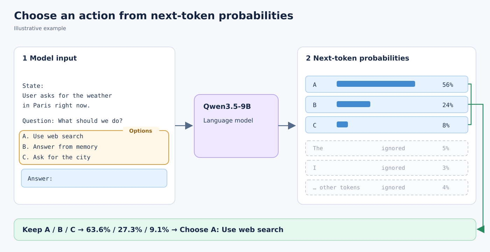

# Letter log-probability decision rule

For each task, we write the state, question, and lettered candidate descriptions in a Qwen3-8B chat prompt with thinking disabled. The prompt ends at `Answer: `. We do **not** ask the model to generate a response. One forward pass yields the next-token logits for the single-token letters `A`, `B`, and so on. We apply `log_softmax` across those candidate-letter logits, rather than across the full vocabulary.

We cyclically rotate the candidates so each semantic option occupies each letter position once. For every rotation, we run one model forward pass and add the log probability of the option's current letter to that option's running score. The prediction is the semantic option with the greatest **sum of log probabilities**. The two-option values in the diagram are illustrative, not benchmark outputs. With *N* candidates, this procedure uses *N* forward passes for each decision.

This matches the implementation in [`scripts/qwen3_8b_letters.py`](../scripts/qwen3_8b_letters.py) and the tool-decision evaluation in [`scripts/run_tool_decisions.py`](../scripts/run_tool_decisions.py). In the latter, candidate descriptions may be shuffled when loading tasks; the score is still accumulated for the same semantic option across rotations.
